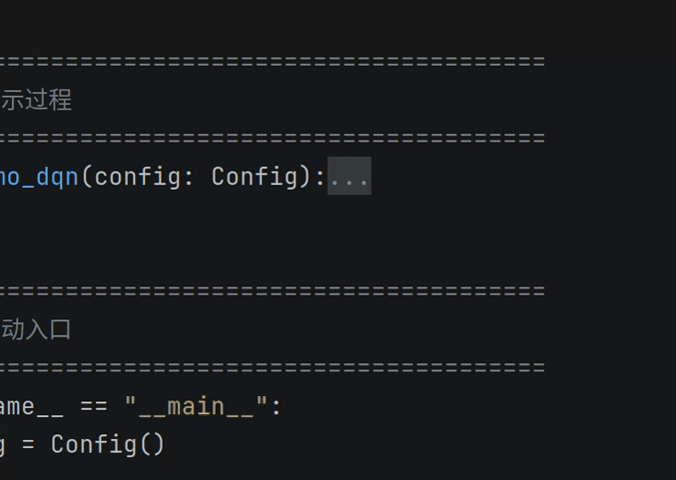
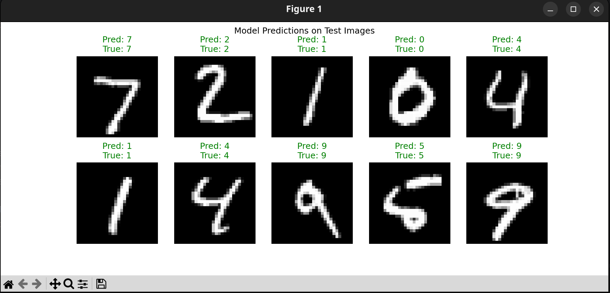

# Basic_RL&NN
### 基础强化学习与神经网络学习记录

项目中包含了基础数字识别的 **BPNN**（反向传播神经网络），以及 **DQN、PPO、SAC** 算法的实现。

其中**DQN、PPO、SAC** 算法的实现均依托于gymnasium环境。

以下是不同任务的简易演示：

---

### 1. 离散决策演示 (DQN / PPO)

  
  
<b>离散决策任务演示</b>

---

### 2. 连续决策演示 (PPO / SAC)

  
  
<b>连续决策任务演示</b>

---

### 3. 基础数字识别 (BPNN)

  
  
<b>BPNN 数字识别演示</b>

